# 📱 پیش‌نمایش اپلیکیشن سوپرمارکت آنلاین

## ✨ صفحه اصلی
<table align="center">
  <tr>
    <td align="center">
      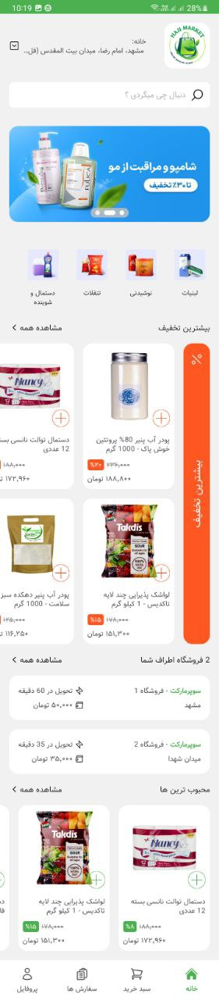
    </td>
    <td align="center">
      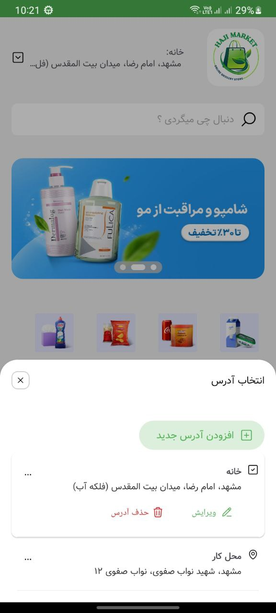
    </td>
    <td align="center">
      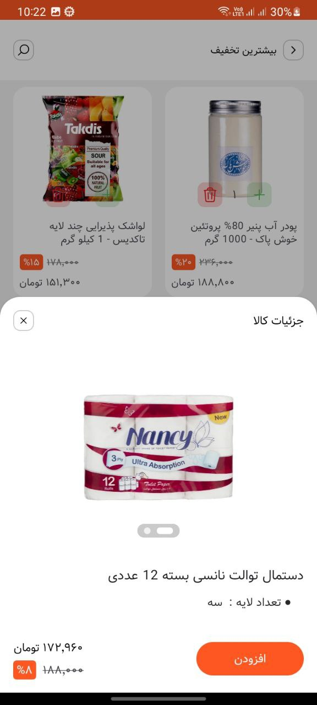
    </td>
  </tr>
  <tr>
    <td align="center"><b>بخش ۱:</b> پیشنهادات ویژه، نمایش دسته‌بندی‌ها، فروشگاه‌های نزدیک</td>
    <td align="center"><b>بخش ۲:</b> نمایش آدرس‌های کاربر و تغییر آدرس</td>
    <td align="center"><b>بخش ۳:</b> جزئیات محصول</td>
  </tr>
</table>

---

## 🏠 افزودن آدرس جدید
<table align="center">
  <tr>
    <td align="center">
      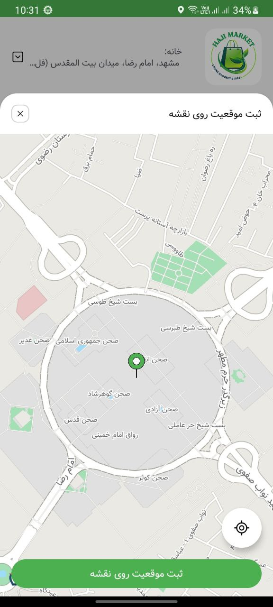
    </td>
    <td align="center">
      
    </td>
  </tr>
  <tr>
    <td align="center"><b>مرحله ۱:</b> ورود به بخش آدرس‌ها</td>
    <td align="center"><b>مرحله ۲:</b> ثبت آدرس و تأیید موقعیت مکانی</td>
  </tr>
</table>

---

## 🛒 سبد خرید و تکمیل سفارش
<table align="center">
  <tr>
    <td align="center">
      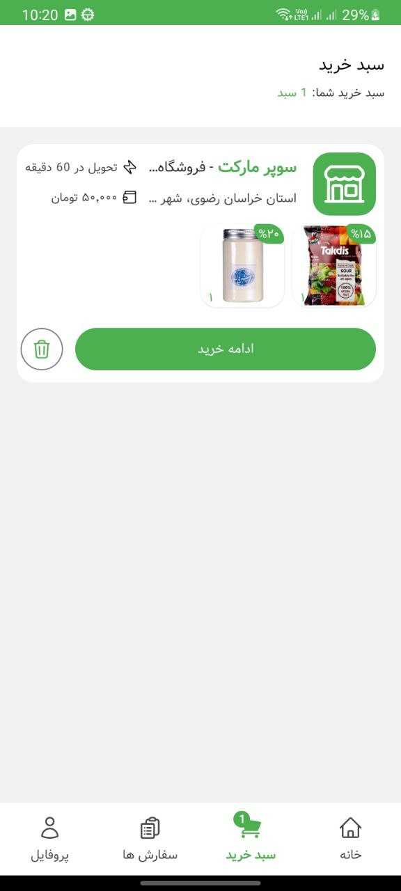
    </td>
    <td align="center">
      
    </td>
    <td align="center">
      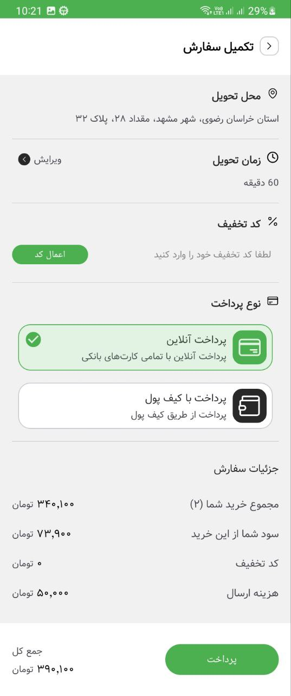
    </td>
  </tr>
  <tr>
    <td align="center"><b>مرحله ۱:</b> مشاهده سبد خرید براساس فروشگاه</td>
    <td align="center"><b>مرحله ۲:</b> مشاهده محصولات</td>
    <td align="center"><b>مرحله ۳:</b> انتخاب روش پرداخت، تأیید نهایی و ثبت سفارش</td>
  </tr>
</table>

---

## 🚚 سفارشات و پیگیری وضعیت
<table align="center">
  <tr>
    <td align="center">
      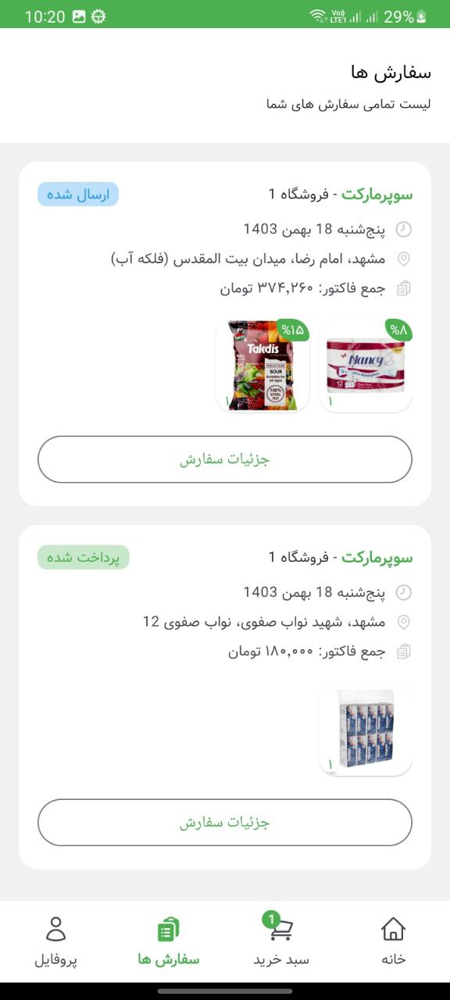
    </td>
    <td align="center">
      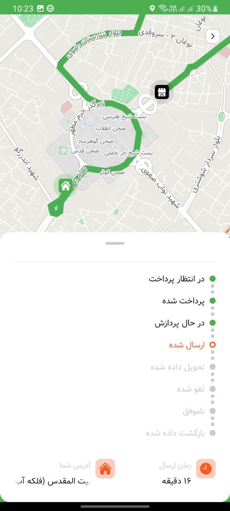
    </td>
  </tr>
  <tr>
    <td align="center"><b>مرحله ۱:</b> مشاهده سفارشات</td>
    <td align="center"><b>مرحله ۲:</b> پیگیری وضعیت سفارش و مراحل ارسال</td>
  </tr>
</table>

---

## 👤 پروفایل
<table align="center">
  <tr>
    <td align="center">
      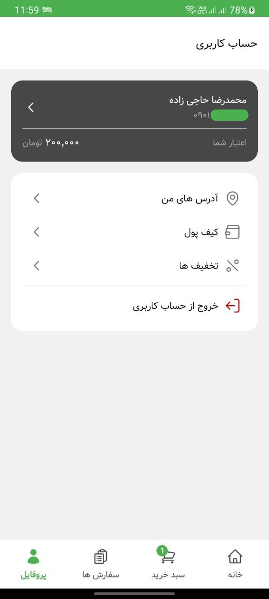
    </td>
    <td align="center">
      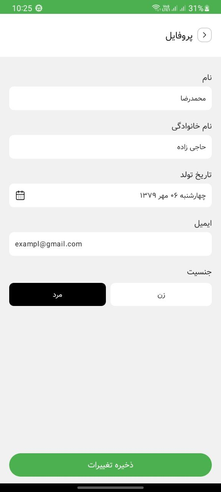
    </td>
    <td align="center">
      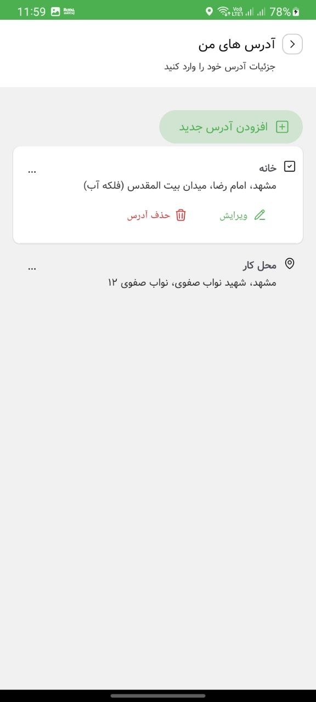
    </td>
    <td align="center">
      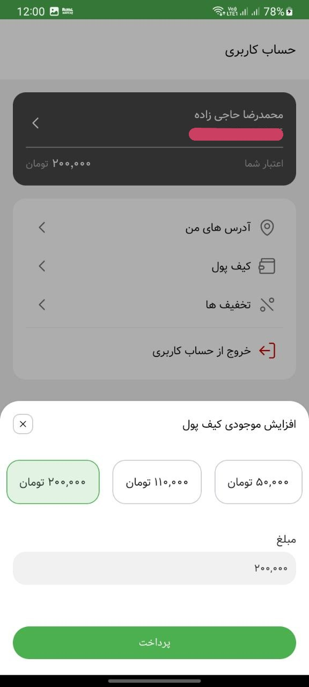
    </td>
    <td align="center">
      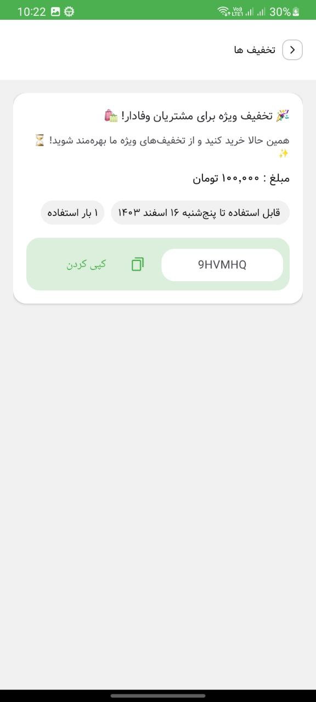
    </td>
  </tr>
  <tr>
    <td align="center"><b>پروفایل:</b> مشاهده موجودی کیف پول، آدرس‌ها و تخفیف‌ها</td>
    <td align="center"><b>ویرایش پروفایل:</b> تغییر اطلاعات کاربری</td>
    <td align="center"><b>آدرس‌های من:</b> مشاهده، حذف و ویرایش آدرس‌ها</td>
    <td align="center"><b>کیف پول:</b> افزایش اعتبار</td>
    <td align="center"><b>تخفیف‌ها:</b> مشاهده و استفاده از کدهای تخفیف</td>
  </tr>
</table>

---

## 🤖 ربات تلگرام سوپرمارکت آنلاین
<table align="center">
  <tr>
    <td align="center">
      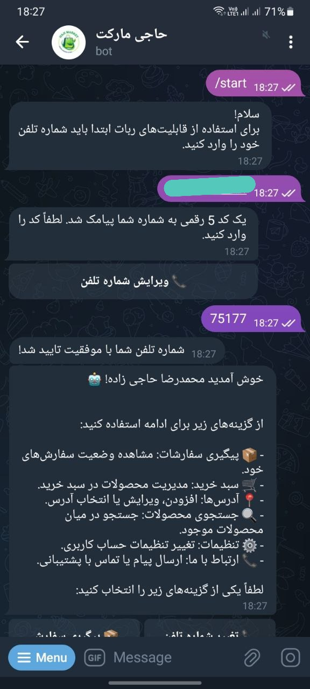
    </td>
    <td align="center">
      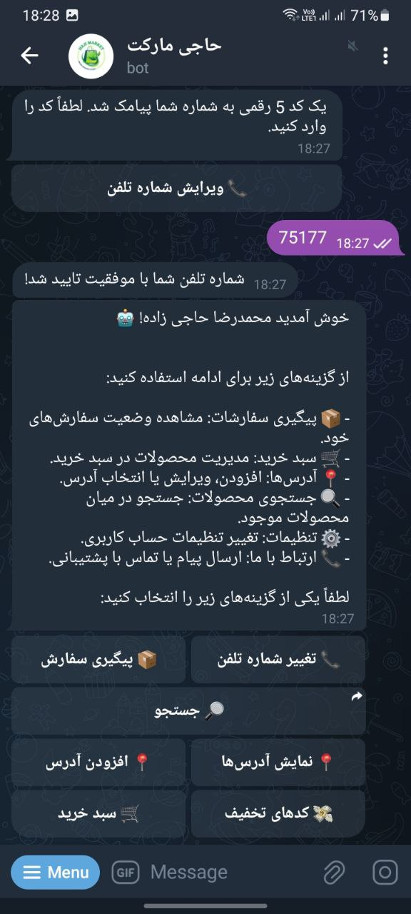
    </td>
  </tr>
  <tr>
    <td align="center"><b>ورود:</b> ورود با شماره همراه و ارسال کد تأیید</td>
    <td align="center"><b>کارکرد:</b> خرید و پیگیری سفارش‌ها از طریق ربات</td>
  </tr>
</table>

---
🛠 تکنولوژی‌های استفاده شده
- **Android (Kotlin)**
- **Laravel (PHP)**
- **Retrofit (برای ارتباط با API)**
- **Neshan API**
- **MVVM Architecture**
- **SharedPreferences (برای ذخیره اطلاعات محلی)**
- **Navigation component (برای مدیریت صفحات اپلیکیشن)**
- **Telegram Bot (Aiogram)**